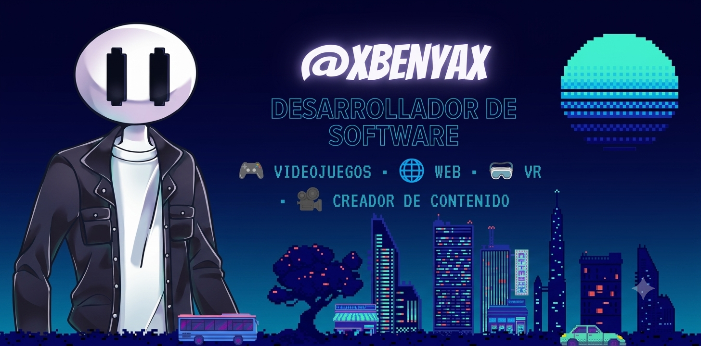
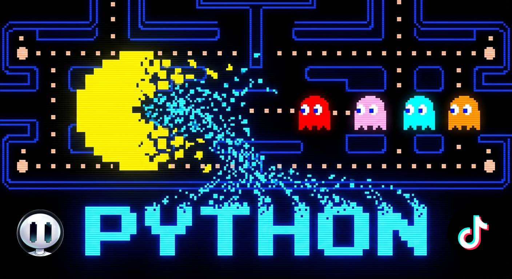
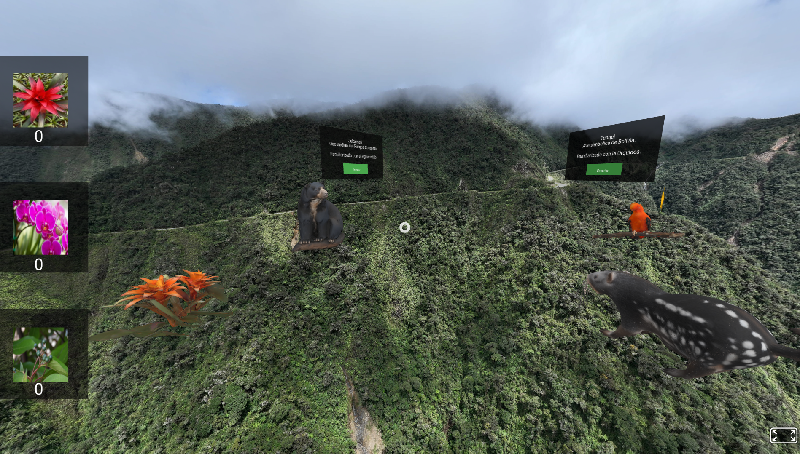
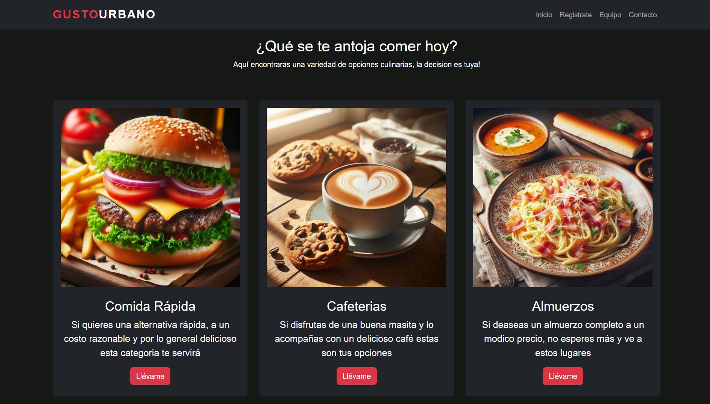

<h1 align="center">Hola, soy <a href="https://aristi.dev">xBenyax</a> 👋</h1>

## 👨‍💻 Sobre mí

- 🎓 Estudiante de Ingeniería de Sistemas en la Universidad Salesiana de Bolivia.
- 🐍 Desarrollando proyectos con Python y Pygame.
- 🌐 Experiencia creando páginas web con HTML, CSS y JavaScript.
- 🥽 Experiencia desarrollando experiencias VR 360° con A-Frame.
- ☕ Conocimientos de Java.
 

## Proyectos *bombitas*

<table> 
<tr> <td width="100%" align="center">
<h3 align="center">🎮 Pac-Man — Aprendiendo Python</h3>

  Mi primer videojuego desarrollado en Python. Actualmente estoy
  <strong>optimizándolo y mejorándolo</strong> mientras documento
  el proceso en la serie <strong>"Aprendiendo Python con Pac-Man"</strong>.

</td>
</tr>
</table>

 

<table> 
<tr>
<td width="50%">
<h3 align="center">🥽 Cotapata VR 360°</h3>

  

 Experiencia de <strong>realidad virtual 360°</strong> desarrollada con <strong>A-Frame</strong>, enfocada en la exploración virtual del Parque Nacional Cotapata. 

</td>
<td width="50%">
<h3 align="center">🌐 Página Web de Restaurantes</h3>

   

 Página web desarrollada como proyecto académico para presentar información y opciones de <strong>restaurantes</strong>, utilizando tecnologías de desarrollo web. 

</td>  
</tr> 
</table>
 

### ⚙️ &nbsp;GitHub Analytics

